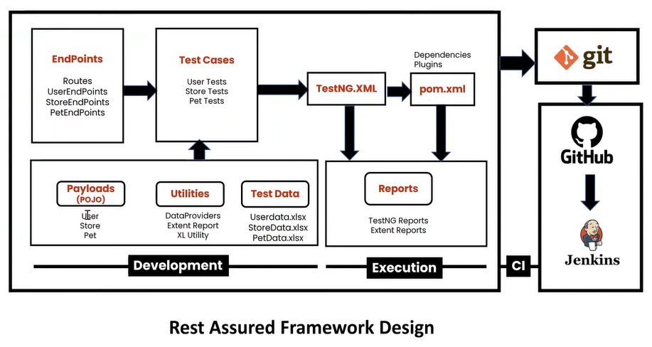
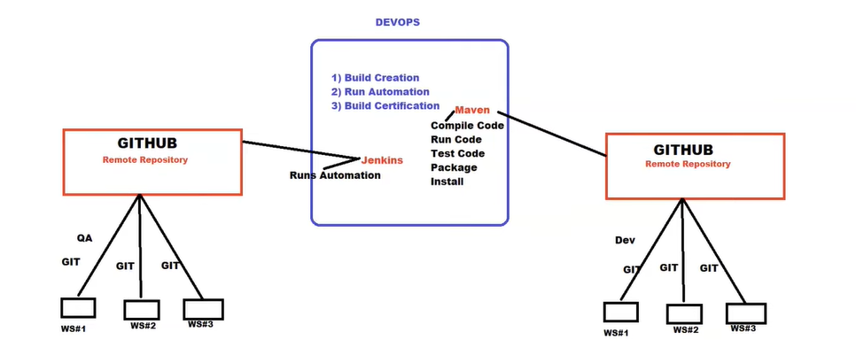

# PetStore Framework to API testing using Hybrid Driven Testing

### Technologies
1. Rest Assured
2. TestNG
3. Apache POI
4. AventStack report

[Documentation: Swagger PetStore](https://petstore.swagger.io/#/)

## Test Cases User
| TCID  | Model | Title       | HTTP Request | URL                                            | Request Body                                                                                                                                                                           | Response                                                                                                                                                                               | Authentication | Status Code |
|-------|-------|-------------|--------------|------------------------------------------------|----------------------------------------------------------------------------------------------------------------------------------------------------------------------------------------|----------------------------------------------------------------------------------------------------------------------------------------------------------------------------------------|----------------|-------------|
| TC001 | User  | Create User | Post         | https://petstore.swagger.io/v2/user            | { "id": 0, "username": "string", "firstName": "string", "lastName": "string", "email": "string", "password": "string", "phone": "string", "userStatus": 0 } | successful operation                                                                                                                                                                   | N\\A           | 200         |
| TC002 | User  | Get User    | Get          | https://petstore.swagger.io/v2/user/{username} | Path Param: Username                                                                                                                                                                   | { "id": 0, "username": "string", "firstName": "string", "lastName": "string", "email": "string", "password": "string", "phone": "string", "userStatus": 0 } | N\\A           | 200         |
| TC003 | User  | Update User | Put          | https://petstore.swagger.io/v2/user/{username} | { "id": 0, "username": "string", "firstName": "string", "lastName": "string", "email": "string", "password": "string", "phone": "string", "userStatus": 0 } | successful operation                                                                                                                                                                   | N\\A           | 200         |
| TC004 | User  | Delete User | Delete       | https://petstore.swagger.io/v2/user/{username} | Path Param: Username                                                                                                                                                                   | Deleted                                                                                                                                                                                | N\\A           | 200         |

## Test Cases Pet
| TCID  | Model | Title      | HTTP   | URL                                        | Request Body                                                                                                                                                                                                             | Response                                                                                                                                                                                                                 | Authentication | Status Code |
|-------|-------|------------|--------|--------------------------------------------|--------------------------------------------------------------------------------------------------------------------------------------------------------------------------------------------------------------------------|--------------------------------------------------------------------------------------------------------------------------------------------------------------------------------------------------------------------------|----------------|-------------|
| TC005 | Pet   | Create Pet | Post   | https://petstore.swagger.io/v2/pet         | { "id": 0, "category": { "id": 0, "name": "string" }, "name": "doggie", "photoUrls": [ "string" ], "tags": [ { "id": 0, "name": "string" } ], "status": "available" } |                                                                                                                                                                                                                          | N/A            | 200         |
| TC006 | Pet   | Get Pet    | Get    | https://petstore.swagger.io/v2/pet/{petId} | Path Param: pet Id                                                                                                                                                                                                       | { "id": 0, "category": { "id": 0, "name": "string" }, "name": "doggie", "photoUrls": [ "string" ], "tags": [ { "id": 0, "name": "string" } ], "status": "available" } | N/A            | 200         |
| TC007 | Pet   | Update Pet | Post   | https://petstore.swagger.io/v2/pet/{petId} | { "id": 0, "category": { "id": 0, "name": "string" }, "name": "doggie", "photoUrls": [ "string" ], "tags": [ { "id": 0, "name": "string" } ], "status": "available" } |                                                                                                                                                                                                                          | N/A            | 200         |
| TC008 | Pet   | Delete Pet | Delete | https://petstore.swagger.io/v2/pet/{petId} | Path Param: pet Id                                                                                                                                                                                                       |                                                                                                                                                                                                                          | N/A            | 200         |

## Test Cases Order
| TCID  | Model | Title         | HTTP   | URL                                                  | Request Body                                                                                                                              | Response                                                                                                                                  | Authentication | Status Code |
|-------|-------|---------------|--------|------------------------------------------------------|-------------------------------------------------------------------------------------------------------------------------------------------|-------------------------------------------------------------------------------------------------------------------------------------------|----------------|-------------|
| TC005 | Order | Create Order  | Post   | https://petstore.swagger.io/v2/store/order           | { "id": 0, "petId": 0, "quantity": 0, "shipDate": "2023-04-03T00:10:52.128Z", "status": "placed", "complete": true } | { "id": 0, "petId": 0, "quantity": 0, "shipDate": "2023-04-03T01:41:03.985Z", "status": "placed", "complete": true } | N/A            | 200         |
| TC006 | Order | Get Order     | Get    | https://petstore.swagger.io/v2/store/order/{orderId} | Path Param: order Id                                                                                                                      | { "id": 0, "petId": 0, "quantity": 0, "shipDate": "2023-04-03T01:42:26.579Z", "status": "placed", "complete": true } | N/A            | 200         |
| TC007 | Order | Delete Order  | Delete | https://petstore.swagger.io/v2/store/order/{orderId} | Path Param: order Id                                                                                                                      |                                                                                                                                           | N/A            | 200         |
| TC008 | Order | Get Inventory | Get    | https://petstore.swagger.io/v2/store/inventory       |                                                                                                                                           | { "totvs": 1, "sold": 2, "string": 434, "pending": 4, "available": 138 }                                                | N/A            | 200         |

### Design Patter

### Git flow

